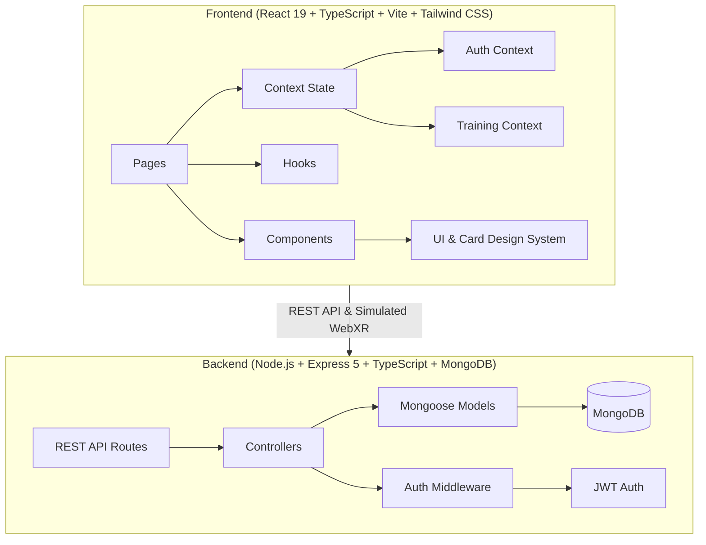

# SmartMine XR 🥽⚡
> **"Train for the danger. Without facing it."**

SmartMine XR is a full-stack, enterprise-grade immersive VR safety training platform designed specifically for underground mining and heavy manufacturing workforces. It allows miners and industrial technicians to access safety training from home or headquarters, review safety protocols and scenario introduction videos, verify WebXR hardware connectivity, engage in simulated high-risk drills, receive instant telemetric evaluations, and maintain cryptographically verifiable credentials.

---

## 🏗️ System Architecture



---

## 🚀 Key Features

1. **High-Fidelity Industrial Aesthetics**:
   - Tailored dark theme with coal/mineral black surfaces (`#050506`), tactile slate cards (`#111114`), and high-visibility safety yellow accents (`#f0c800`).
   - Tactile 3D button press animations, glowing status rings, and smooth micro-animations.

2. **Complete 15-Page Application Suite**:
   - **Home (`/`)**: Hero banner with custom-generated VR industrial imagery, "What is SmartMine XR", 4-step workflow, feature highlights, and interactive scenario showcase.
   - **Training (`/training`)**: Full catalog of mining scenarios with difficulty ratings and status badges.
   - **Scenario Detail (`/scenario/:id`)**: Drill overview, hazard profiles, learning objectives, VR requirements, and introduction video modal.
   - **VR Setup (`/vr-setup/:id`)**: Automated sequential checklist verifying headset connection, browser WebXR flags, controllers, and physical perimeter.
   - **Training Session (`/training-session/:id`)**: Simulated immersive in-progress drill with animated radial progress gauge and elapsed timer.
   - **Training Result (`/training-result/:id`)**: Comprehensive score breakdown across Reaction Time, Safety Decisions, Hazard Awareness, and Emergency Response.
   - **Content (`/content`)**: Curated training video library, category filters, interactive video modal, and downloadable industrial MSHA safety manuals.
   - **Product (`/product`)**: In-depth showcase of the 6 core simulation modules, physics engine specs, and hardware ecosystem compatibility matrix.
   - **Plans (`/plans`)**: 4 tier pricing cards (Free 1-Month Trial, Monthly, 5-Month Popular, Enterprise Pro) with instant simulated plan activation and feature comparison table.
   - **Support (`/support`)**: Searchable FAQ accordion, hardware setup guides, direct contact channels, and interactive ticket submission form.
   - **Dashboard (`/dashboard`)**: Protected worker command center with progress KPIs, quarterly compliance metrics, continue training drill, and recent session audit history.
   - **Certificates (`/certificates`)**: Official credential registry with cryptographic SHA-256 ledger verification modals and PDF download simulation.
   - **Profile (`/profile`)**: Personal credentials, active subscription management, and VR controller haptics/notification preferences.
   - **Login (`/login`) & Register (`/register`)**: Industrial authentication with one-click demo worker credential autofill and automatic free trial enrollment.

3. **Resilient Dual-Mode Operation**:
   - **Standalone Demo Mode**: Frontend operates fully out-of-the-box with reactive contexts and rich mock data.
   - **Full-Stack REST Mode**: Backend Express server provides complete MongoDB persistence with JWT authentication.

---

## 📦 Directory Structure

```
AGIDE/
├── frontend/
│   ├── public/
│   │   ├── hero-bg.jpg          # Generated custom hero imagery
│   │   └── icons.svg
│   ├── src/
│   │   ├── components/
│   │   │   ├── auth/            # ProtectedRoute
│   │   │   ├── cards/           # ScenarioCard, VideoCard, PricingCard, DashboardCard, CertificateCard
│   │   │   ├── layout/          # Navbar, Footer, PageWrapper
│   │   │   ├── sections/        # FAQAccordion
│   │   │   └── ui/              # Button, Card, Modal, ProgressBar, LoadingState, EmptyState
│   │   ├── context/             # AuthContext, TrainingContext
│   │   ├── data/                # mockData.ts
│   │   ├── hooks/               # useScrollAnimation.ts
│   │   ├── pages/               # 15 Complete Pages
│   │   ├── types/               # TypeScript interfaces
│   │   ├── App.tsx              # React Router & Global Providers
│   │   ├── index.css            # Tailwind design system tokens
│   │   └── main.tsx
│   ├── package.json
│   └── vite.config.ts
│
├── backend/
│   ├── src/
│   │   ├── config/db.ts         # Mongoose connection
│   │   ├── controllers/         # Auth, User, Scenario, Training, Certificate, Subscription
│   │   ├── middleware/auth.ts   # JWT verification
│   │   ├── models/              # User, Scenario, TrainingSession, Certificate, Subscription
│   │   ├── routes/              # Express API routers
│   │   └── server.ts            # Server entrypoint
│   ├── .env.example
│   ├── package.json
│   └── tsconfig.json
│
└── README.md
```

---

## 🛠️ Quick Start

### 1. Run the Frontend (Immediate Demo)

```bash
cd frontend
npm run dev
```

Open [http://localhost:5173](http://localhost:5173) in your browser.

- Use the **"Click to Auto-Fill Demo Worker Credentials"** button on the Login page (`/login`) to explore worker dashboard features instantly!

### 2. Run the Backend (Optional Persistence)

```bash
cd backend
npm install
npm run dev
```

The REST API will launch at [http://localhost:5000](http://localhost:5000).
- Health check: `GET http://localhost:5000/api/health`

---

## 🔒 Security & Compliance Standards
- **MSHA Part 48 Guidelines**: Aligned with underground mine retraining standards.
- **SHA-256 Ledger Signatures**: Tamper-proof certificate IDs for safety audits.
- **WebXR Device Architecture**: Compatible with Meta Quest, HTC Vive, and Valve Index.

© 2026 SmartMine XR. All rights reserved.
